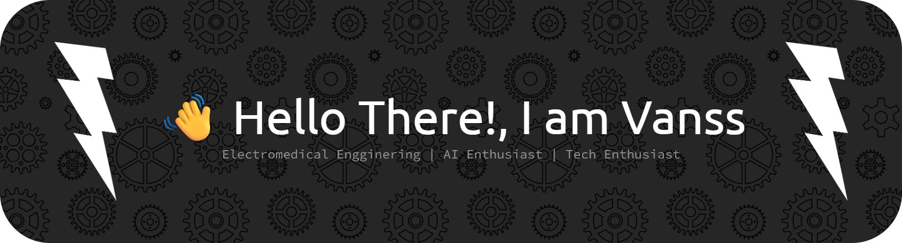

I'm a first-year student at **Politeknik Kesehatan Surabaya**, majoring in **Technology of Electromedical Engineering**.  
I love creating things — from **websites**, **IoT projects**, to **hardware systems** that connect the digital and physical world.

---

### 🧠 What I Do

- 🧩 Build **embedded systems** with Arduino & ESP32  
- 💡 Create **IoT & sensor-based projects** (e.g., PCG Monitor, self-balancing robot, web oscilloscope)  
- 🌍 Develop **web applications** using **Laravel**, **PHP**, and **JavaScript**  
- 🧰 Experiment with **data processing**, **signal analysis**, and **machine learning**

---

### 🛠️ Tech Stack

#### 💾 Hardware & IoT
`ESP32` · `Arduino` · `MAX7219` · `TinyRTC` · `Sensors`  

#### 🌐 Web Development
`HTML` · `CSS` · `JavaScript` · `Laravel` · `PHP` · `MySQL`  

#### 📊 Data & Tools
`Python` · `MATLAB` · `PyQt` · `NumPy` · `pandas` · `Scikit-learn`

---

### 📚 Current Projects

- ⚙️ **Self-Balancing Robot (ESP32 Based)**
- 📈 **Web-based Oscilloscope**
- 🧠 **PCG Signal Classifier**
- 🌐 **Personal Portfolio Website**
- 💬 **Web-based Running Text Controller**

---

### 🧭 Goals

> “To merge healthcare technology with smart embedded systems.”

🎯 Learn advanced control systems & signal processing  
🚀 Build a personal IoT platform  
📘 Share projects & tutorials for other makers and students  

---

### 📫 Get in Touch

- 📧 **Email:** [cavanrzlar@gmail.com](mailto:cavanrzlar@gmail.com)  
- 🌍 **Portfolio:** _coming soon_  
- 💬 Feel free to reach out for collaborations or discussions about tech!

---

### ⚡ Fun Facts

- 🎮 Love playing **Genshin Impact** & **Mobile Legends**  
- 📖 Enjoy reading **novels** and **philosophy books**  
- 🧠 Always excited to **learn something new**  
- 😖 Dislike **cockroaches**, **traffic jams**, and **carrot juice**

---

  
  

---

✨ _“Create, Explore, and Innovate — one project at a time.”_ ✨

